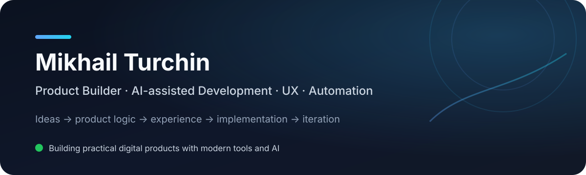

<p align="center">
  
</p>

## About

I build practical digital products by combining **product thinking, UX, automation and AI-assisted development**.

I’m less interested in writing code for its own sake and more interested in the full path from an idea to a working product: defining how it should behave, designing the user flow, finding weak points, testing real scenarios and iterating until the experience feels right.

AI is a core part of my workflow for research, prototyping, implementation, debugging, testing and documentation — with human product decisions staying at the center.

### What I focus on

| 💡 Product thinking | 🧭 UX & flows | 🤖 AI-assisted development | 🔁 Iteration |
|---|---|---|---|
| Turning ideas into clear product logic | Making complex things feel simple | Using modern AI tools to build faster | Test, improve, repeat |

## Featured project

### 🔵 Grabfolio

**Telegram media automation platform** — a practical product focused on fast, simple media delivery through Telegram.

<p>
  
  
  
  
  
  
  
  
</p>

**My role:** product concept, UX and interaction logic, feature design, testing, iteration and AI-assisted implementation.

**Product areas:** Telegram UX · media workflows · caching · background jobs · reliability · infrastructure · multilingual interface.

[](https://t.me/GrabfolioBot)

> The production source code is kept private. This public profile is a showcase of the product and the work behind it.

## Other product work

I also work on **private digital products** involving Telegram Mini Apps, subscription flows, payments, product UX and backend infrastructure. Some projects stay intentionally private while they are being developed.

## How I work

```text
Idea → Product logic → UX/UI → AI-assisted implementation → Testing → Launch → Improve
```

I like working close to the product itself: understanding what a user should see, what should happen next, where something feels wrong and how the whole system can become simpler and more reliable.

## Tools & technologies

<p>
  
  
  
  
  
  
  
  
  
  
</p>

---

<p align="center">
  <sub>Building useful things, learning by doing, and improving every iteration.</sub>
</p>
